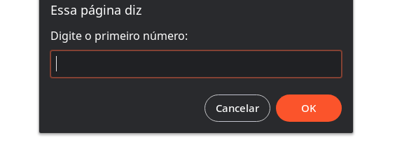

<h1 align="center"> 👨🏼‍💻Desafio Explorer - JavaScript </h1>
 

  ⚠️ <strong>ATENÇÃO</strong> ⚠️
   
  Este é um projeto conceitual e não representa uma empresa ou serviço real.  
  Ele foi criado com o propósito de ser adicionado ao meu portfólio, demonstrando minhas habilidades e capacidades em projetos de design e desenvolvimento.  
  <a href="https://rocketforms.typeform.com/to/fPcSmBp9#referral_id=e8eb53b2-1777-4867-9b33-d468fc9d1422o">Estude projetos como este em formato de vídeo clicando aqui!</a>

  <a href="#-tecnologias">Tecnologias</a>&nbsp;&nbsp;&nbsp;|&nbsp;&nbsp;&nbsp;
  <a href="#-projeto">Projeto</a>&nbsp;&nbsp;&nbsp;

## 🚀 Tecnologias

Esse projeto foi desenvolvido com as seguintes tecnologias & ferramentsa:

- HTML e JavaScript
- VsCode
- Git e Github

 

## 💻 Sobre o Desafio

<h3>💡 O que foi abordado nesse desafio:</h3>

- Variáveis
- Operações matemáticas;
- Operadores comparativos;
- Condicional.

 

<h4> 👾 O desafio,consiste em você solicitar ao usuário que ele insira dois números e, a partir daí, calcular:</h4>

- A soma dos dois números;
- A subtração dos dois números;
- A multiplicação dos dois números;
- A divisão dos dois números;
- O resto da divisão dos dois números;

<h4> 👀 2ª parte do desafio  </h4>

- Verifique se a soma dos dois números é par ~~(ou ímpar)~~;
- Verifique se os dois números inseridos são iguais ~~(ou diferentes)~~.

  

<h2>🚀👨🏼‍🚀#desafiosrocketseat</h2> 

 😎 Desenvolvido com estilo by Pablo Perdigão, aluno Explorer da Rocketseat!  
[🤝🏼🌐 Siga-me & ajude na criação de uma rede cada vez mais interconectada!](https://www.instagram.com/perdigao.techjourney)

